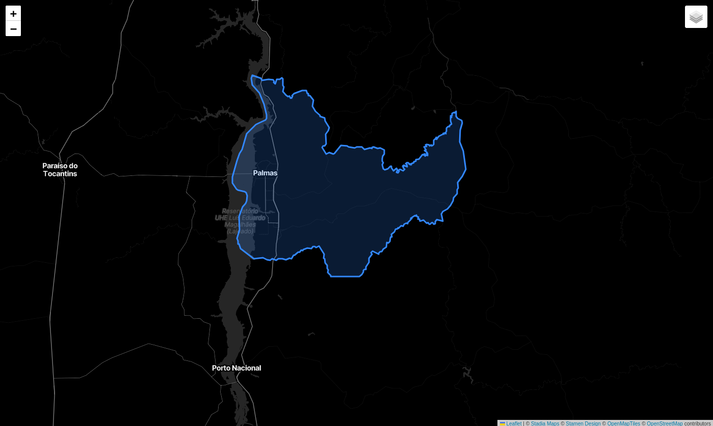

<div align="center">


<h1>Constructo</h1>

<p><strong>Acompanhamento visual de obras com dados geoespaciais</strong></p>

</div>

<hr>

## 👥 Equipe

- [José Carlos da Silva Neto](https://github.com/jcarlos721)
- [Eduardo Lopes de Oliveira Torres](https://github.com/EduLps1)
- [Pedro Ryan Oliveira de Almeida](https://github.com/PdroRyan)
- [Samuel Andrade Luz Carneiro](https://github.com/Samuel1-salc)

<hr>

<hr>

## 📚 Sumário

- [Sobre o projeto](#-sobre-o-projeto)
- [Problema](#-problema)
- [Solução proposta](#-solução-proposta)
- [Escopo da entrega](#-escopo-da-entrega-da-disciplina)
- [Requisitos](#-requisitos-funcionais)
- [GeoJSON no Constructo](#-geojson-no-constructo)
- [Demonstração inicial](#-demonstração-inicial)
- [Jornada principal](#-jornada-principal)
- [Critérios de conclusão](#-critérios-de-conclusão-da-entrega)
- [Evolução futura](#-evolução-futura)

<hr>

## 🎓 Informações acadêmicas

<div align="center">

<table align="center">
  <tbody>
    <tr>
      <th align="left">Instituição</th>
      <td align="left">Universidade Federal do Tocantins (UFT)</td>
    </tr>
    <tr>
      <th align="left">Curso</th>
      <td align="left">Bacharelado em Ciência da Computação</td>
    </tr>
    <tr>
      <th align="left">Disciplina</th>
      <td align="left">Desenvolvimento Webmobile</td>
    </tr>
    <tr>
      <th align="left">Professor</th>
      <td align="left">Jackson Gomes de Souza</td>
    </tr>
    <tr>
      <th align="left">Semestre</th>
      <td align="left">2026.2</td>
    </tr>
  </tbody>
</table>

</div>

## 🏗️ Sobre o projeto

O **Constructo** é uma proposta de plataforma para o acompanhamento visual do avanço de obras. Seu objetivo é tornar informações de localização, identificação e andamento dos empreendimentos mais claras e fáceis de consultar.

Durante a disciplina, o projeto será desenvolvido como um módulo funcional de **acompanhamento de obras baseado em dados GeoJSON**. A aplicação utilizará informações geoespaciais para posicionar as obras no mapa e apresentar seus respectivos dados de acompanhamento.

> [!IMPORTANT]
> **Escopo desta entrega:** visualização e acompanhamento de obras por meio de dados GeoJSON.

A visão completa da plataforma inclui outros recursos, como autenticação, gestão de usuários, evidências fotográficas, auditoria e visualização tridimensional. Esses recursos não fazem parte da entrega da disciplina e estão registrados neste documento apenas como possibilidades de evolução futura.

<hr>

## 🎯 Problema

Informações sobre o andamento de obras frequentemente ficam distribuídas entre planilhas, relatórios e diferentes canais de comunicação. Além de dificultar a consulta, essa fragmentação reduz a clareza sobre onde cada obra está localizada e qual é sua situação atual.

O Constructo busca facilitar essa leitura ao reunir a localização e os dados essenciais das obras em uma interface cartográfica interativa.

<hr>

## 💡 Solução proposta

O módulo recebe dados no formato **GeoJSON** e os representa em um mapa. Cada elemento geográfico corresponde a uma obra ou área de interesse e pode conter propriedades descritivas, como nome, etapa, percentual de conclusão e última atualização.

O fluxo principal da aplicação é:

<p align="center">
  <strong>Dados GeoJSON → Processamento pela aplicação → Representação no mapa → Consulta do andamento da obra</strong>
</p>

Essa abordagem permite relacionar a situação de cada obra à sua localização, tornando o acompanhamento mais direto e visual.

<hr>

## 📦 Escopo da entrega da disciplina

### Funcionalidades previstas

- carregar dados de obras estruturados no formato GeoJSON;
- representar no mapa pontos, linhas ou polígonos presentes nesses dados;
- identificar visualmente as obras ou áreas mapeadas;
- permitir a seleção de um elemento geográfico;
- exibir os dados de acompanhamento associados ao elemento selecionado;
- diferenciar visualmente as obras de acordo com seu estado de execução, quando essa informação estiver disponível no GeoJSON;
- adaptar a interface a diferentes tamanhos de tela.

### Fora do escopo desta entrega

As funcionalidades abaixo representam a visão futura do Constructo e **não fazem parte do módulo entregável durante a disciplina**:

- autenticação, autorização e gestão de usuários;
- gestão de construtoras, empreendimentos, torres, pavimentos e unidades;
- cadastro e edição de obras por meio de um painel administrativo;
- fluxo de aprovação e publicação de atualizações;
- envio de fotos, documentos e outras evidências;
- timeline, comunicados e notificações;
- vinculação de clientes a unidades e módulo **Meu Apê**;
- histórico de alterações e auditoria;
- isolamento de dados entre construtoras;
- integração com serviços externos e sistemas de gestão;
- visualização 3D e processamento de modelos GLB, glTF, BIM ou IFC;
- relatórios, indicadores e análises avançadas.

<hr>

## ✅ Requisitos funcionais

<div align="center">

<table align="center">
  <thead>
    <tr>
      <th align="center">Código</th>
      <th align="left">Requisito</th>
    </tr>
  </thead>
  <tbody>
    <tr>
      <td align="center"><strong>RF01</strong></td>
      <td align="left">A aplicação deve carregar uma fonte de dados válida no formato GeoJSON.</td>
    </tr>
    <tr>
      <td align="center"><strong>RF02</strong></td>
      <td align="left">A aplicação deve representar no mapa as geometrias contidas no GeoJSON.</td>
    </tr>
    <tr>
      <td align="center"><strong>RF03</strong></td>
      <td align="left">O usuário deve conseguir selecionar uma obra ou área representada no mapa.</td>
    </tr>
    <tr>
      <td align="center"><strong>RF04</strong></td>
      <td align="left">A aplicação deve apresentar as propriedades de acompanhamento do elemento selecionado.</td>
    </tr>
    <tr>
      <td align="center"><strong>RF05</strong></td>
      <td align="left">A aplicação deve utilizar diferenciação visual para comunicar o estado das obras, quando esse dado estiver disponível.</td>
    </tr>
    <tr>
      <td align="center"><strong>RF06</strong></td>
      <td align="left">A aplicação deve informar de maneira compreensível a ocorrência de dados inválidos ou falhas no carregamento.</td>
    </tr>
  </tbody>
</table>

</div>

<hr>

## ⚙️ Requisitos não funcionais

<div align="center">

<table align="center">
  <thead>
    <tr>
      <th align="center">Código</th>
      <th align="left">Requisito</th>
    </tr>
  </thead>
  <tbody>
    <tr>
      <td align="center"><strong>RNF01</strong></td>
      <td align="left">A interface deve ser responsiva e adequada à interação em dispositivos móveis.</td>
    </tr>
    <tr>
      <td align="center"><strong>RNF02</strong></td>
      <td align="left">A navegação e as interações com o mapa devem permanecer fluidas para o conjunto de dados utilizado na disciplina.</td>
    </tr>
    <tr>
      <td align="center"><strong>RNF03</strong></td>
      <td align="left">As informações textuais e os estados visuais devem ser legíveis e de fácil compreensão.</td>
    </tr>
    <tr>
      <td align="center"><strong>RNF04</strong></td>
      <td align="left">A aplicação deve preservar a integridade dos arquivos GeoJSON de origem durante sua leitura.</td>
    </tr>
    <tr>
      <td align="center"><strong>RNF05</strong></td>
      <td align="left">Erros de carregamento ou de estrutura dos dados devem ser tratados sem interromper toda a interface.</td>
    </tr>
  </tbody>
</table>

</div>

<hr>

## 🗺️ GeoJSON no Constructo

O [GeoJSON](https://geojson.org/) é um formato baseado em JSON utilizado para representar dados geográficos. Ele permite armazenar geometrias como pontos, linhas e polígonos, além de propriedades associadas a cada elemento.

No contexto do Constructo:

- a propriedade `geometry` determina onde e como a obra será representada no mapa;
- o objeto `properties` armazena as informações utilizadas no acompanhamento;
- cada `Feature` representa uma obra ou uma área relevante para o projeto.

Exemplo conceitual de uma obra:

```json
{
  "type": "Feature",
  "geometry": {
    "type": "Point",
    "coordinates": [-48.3336, -10.184]
  },
  "properties": {
    "nome": "Obra Exemplo",
    "status": "em_execucao",
    "progresso": 45,
    "ultimaAtualizacao": "2026-08-31"
  }
}
```

> Os nomes e valores das propriedades poderão ser ajustados de acordo com o conjunto de dados adotado pela equipe.

<hr>

## 📍 Demonstração inicial

A demonstração inicial apresenta a delimitação geográfica do município de Palmas por meio de dados GeoJSON. A imagem serve como referência visual para demonstrar como uma área geográfica pode ser identificada, desenhada e destacada no mapa.

Na aplicação, o mesmo princípio será utilizado para representar geograficamente as obras cadastradas. Dependendo dos dados disponíveis, uma obra poderá ser representada por um ponto, linha ou polígono e associada a propriedades como empresa responsável, nome do empreendimento, status, percentual de progresso e data da última atualização.

Essa demonstração valida o conceito central do projeto:

<p align="center">
  <strong>Delimitação de Palmas → Representação geográfica das obras → Associação dos dados de acompanhamento → Visualização no mapa</strong>
</p>

<div align="center">



<p><em>Figura 1 — Limites territoriais do município de Palmas/TO.</em></p>

</div>

<hr>

## 🔄 Jornada principal

1. A aplicação carrega os dados GeoJSON disponíveis;
2. as obras são posicionadas e identificadas no mapa;
3. o usuário navega pelo mapa e seleciona uma obra;
4. a aplicação apresenta as informações de acompanhamento associadas;
5. o usuário compara a localização e a situação das obras mapeadas.

<hr>

## 🏁 Critérios de conclusão da entrega

O módulo será considerado concluído quando:

- um arquivo GeoJSON válido puder ser carregado pela aplicação;
- as geometrias forem exibidas corretamente no mapa;
- o usuário puder selecionar uma obra e consultar seus dados;
- os estados definidos no conjunto de dados possuírem uma representação compreensível;
- a interface funcionar adequadamente no ambiente definido para a disciplina;
- falhas comuns de carregamento forem comunicadas ao usuário.

<hr>

## 🚀 Evolução futura

Após a entrega acadêmica, o Constructo poderá evoluir gradualmente para uma plataforma mais ampla:

1. **Gestão da plataforma:** autenticação, perfis, permissões e cadastro de empreendimentos;
2. **Atualização colaborativa:** registro, validação e publicação do progresso das obras;
3. **Comunicação:** fotos, documentos, timeline, comunicados e notificações;
4. **Rastreabilidade:** histórico de alterações e auditoria;
5. **Experiência do cliente:** unidades vinculadas, módulo Meu Apê e acompanhamento personalizado;
6. **Visualização avançada:** modelos 3D, BIM/IFC, realidade aumentada e visitas virtuais;
7. **Inteligência de dados:** relatórios, indicadores, planejado versus realizado e integrações externas.

Essas etapas são direcionamentos de produto e não constituem compromisso de implementação durante a disciplina.
