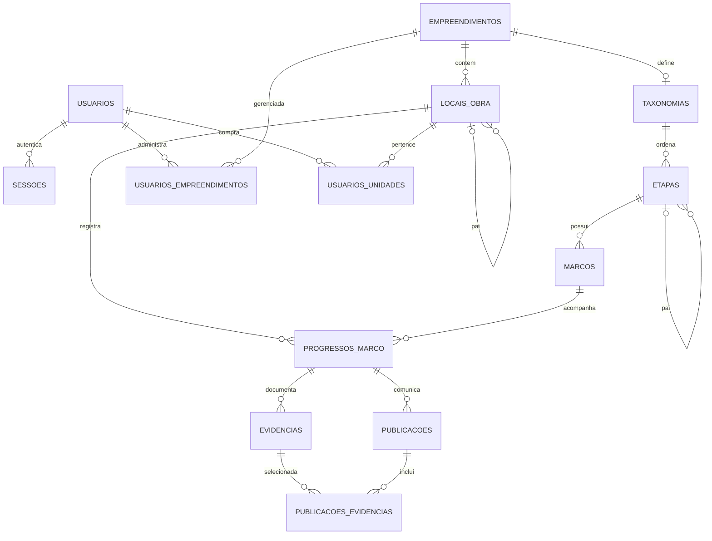

# Constructo — domínio V1 (Epic 1)

Este documento orienta as issues #1–#12. A V1 demonstra o caminho **gestor → marco → evidência → publicação → comprador**. Nomes físicos de tabelas estão no DER abaixo.

## Vocabulário e regras

| Conceito | Definição e regra V1 |
| --- | --- |
| Empreendimento | Obra residencial administrada por gestores; possui uma taxonomia própria e locais físicos. |
| Local da obra | Árvore `TORRE → PAVIMENTO → UNIDADE`; raízes são torres. O empreendimento é a raiz lógica e não é duplicado como local. Pai e filho pertencem ao mesmo empreendimento. Na V1 o serviço valida tipo do pai, profundidade e ausência de ciclos. |
| Taxonomia | Plano de etapas de um empreendimento, no máximo uma por empreendimento; pode ser criada antes dos locais. |
| Etapa | Grupo ordenado, com `parent_id` opcional para uma subetapa. Na V1 só é permitida uma subetapa por nível; o serviço valida pai na mesma taxonomia, profundidade e ciclos. |
| Marco | Resultado verificável de uma etapa, com nome e descrições técnica e para comprador. A definição é um modelo, não um evento ocorrido. |
| Progresso do marco | Ocorrência de um marco em uma **unidade** concreta. Par `(local_obra_id, marco_id)` é único. O serviço deve verificar que a unidade pertence ao empreendimento da taxonomia do marco. |
| Evidência | Arquivo e metadados de captura atribuídos a uma ocorrência; é registro interno, sem visibilidade automática ao comprador. `arquivo_url` identifica o objeto, não autoriza acesso público. |
| Publicação | Texto voltado ao comprador vinculado a uma ocorrência; rascunho tem `publicado_em = NULL`; publicação exige autor, instante e escolha explícita das evidências. Apenas publicações autorizadas são exibidas. |
| Publicação × evidência | Relação N:N `publicacoes_evidencias`, pois fotos podem compor atualizações distintas. O serviço exige que as evidências escolhidas sejam do mesmo progresso da publicação. |
| Comprador × unidade | Relação N:N; um comprador pode ter mais de uma unidade e uma unidade mais de um comprador. O serviço só aceita locais do tipo `UNIDADE`. Apenas essas unidades podem ser lidas pelo comprador. |
| Gestor × empreendimento | Relação N:N; o serviço exige usuário ativo com papel `GESTOR`. `ADMIN` tem acesso global, mediante autorização explícita; vínculo não eleva papel. |

## Estados e progresso (#7, #8)

`NAO_INICIADO → EM_ANDAMENTO → CONCLUIDO`; a V1 admite reabertura `CONCLUIDO → EM_ANDAMENTO`. O registro da justificativa fica para a evolução com histórico de alterações. Não há salto direto de não iniciado a concluído. Início e conclusão são datas da ocorrência, não da definição de marco. Ao reabrir, limpar `concluido_em`; ao concluir, exigir `iniciado_em` e definir `concluido_em >= iniciado_em`. `alterar_estado` bloqueia a linha durante a transição e executa a mudança na transação da sessão.

O progresso de uma unidade é `marcos concluídos aplicáveis / marcos aplicáveis × 100`, arredondado ao inteiro; sem marcos, 0%. Marcos sem linha em `progressos_marco` contam como não iniciados. Só contam os marcos da taxonomia do mesmo empreendimento. O progresso de etapa usa seus marcos e os de suas subetapas. A agregação do empreendimento é a razão entre todos os pares unidade × marco aplicáveis, não a média de percentuais previamente arredondados. Não representa percentual financeiro da obra. Mudanças na taxonomia alteram o denominador: congelar/versar taxonomia ficará para uma fase posterior.

## DER (#11)

Chaves e atributos estão em `modulos/dominio/modelos.py`; o banco impõe FKs, unicidades, estados/datas válidos e a integridade de publicação (autor/data juntos). As validações que atravessam tabelas estão em `modulos/dominio/servicos.py`: árvore de locais e etapas, papel e vínculo do usuário, unidade/marco do mesmo empreendimento, evidência do mesmo progresso, seleção explícita de fotos e visibilidade de publicações. Essas funções usam a sessão recebida: o chamador deve confirmar ou desfazer toda a operação; `get_db` já faz isso na API existente. Na V1 a seleção exige ao menos uma evidência. Não há endpoints novos nesta etapa.

`calcular_progresso_unidade` busca todos os marcos da taxonomia, incluindo os sem linha de progresso; pode filtrar etapa e suas subetapas. `calcular_progresso_empreendimento` usa pares unidade × marco e só arredonda no final. Para um conjunto vazio, retorna 0. Leituras do comprador devem usar `pode_ler_unidade` / `publicacoes_da_unidade`; não se deve servir `arquivo_url` como arquivo público sem autorização.

## Verificação do Epic 1

`tests/test_dominio.py` cobre enums e contratos; `tests/test_dominio_integracao.py` cobre serviços em SQLite com FKs ligadas. O workflow `.github/workflows/epic-01-dominio.yml` executa a suíte e o script `scripts/verificar_epic01_postgres.py` em um PostgreSQL temporário: upgrade com usuário legado, downgrade/upgrade das invariantes, comparação de metadata via `alembic check` e duas transições simultâneas do mesmo marco. O teste PostgreSQL deve passar antes de fechar o Epic. Endpoints futuros devem manter o mesmo bloqueio e limite de transação dos serviços.

## Entidades anteriores (#12) e transição de dados

Neste checkout, o backend possui somente `usuarios` e `sessoes`; `contrato`, `obra`, `medicao` e `item_contratual` não têm tabelas para remover. A primeira migration permanece intacta. Campos `usuarios.empreendimento` e `usuarios.unidade` são textos legados exigidos pelo cadastro atual: **não são chave nem concessão de acesso**. A migração adiciona `papel = COMPRADOR` para registros existentes, sem criar associações ou dar acesso automaticamente. Antes de remover os campos, será preciso reconciliar os textos com locais reais e adaptar contrato HTTP e formulários. A senha existente é preservada; autorização administrativa só deverá ser concedida por fluxo controlado. Não usar dados de exemplo para inferir vínculos reais.

## Critérios de aceite para a próxima fase

1. O gestor autenticado e vinculado cadastra empreendimento, árvore e taxonomia válida.
2. O serviço cria progresso somente para unidade e marco do mesmo empreendimento.
3. Fotos privadas continuam inacessíveis ao comprador até a publicação com seleção explícita.
4. Comprador vê apenas suas unidades e publicações divulgadas.
5. Os serviços rejeitam relações entre empreendimentos e transições inválidas; as futuras rotas devem chamá-los na mesma transação.
